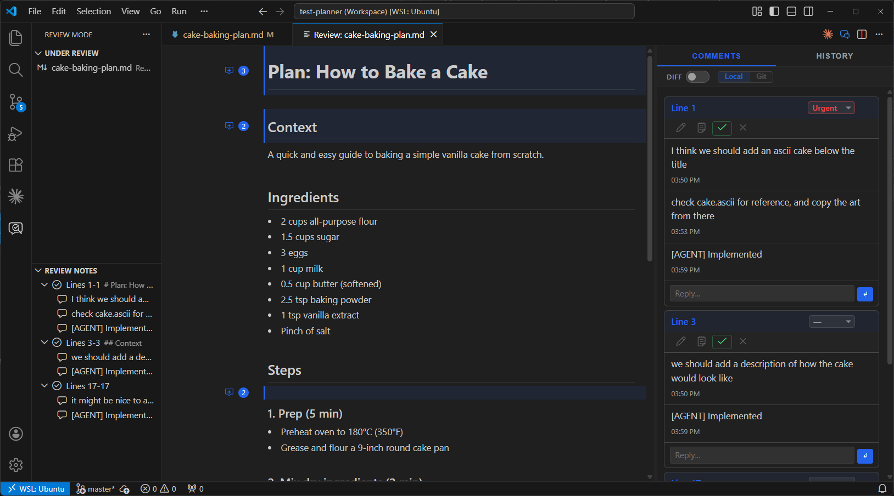
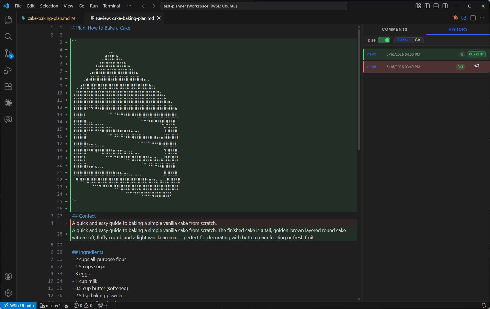

# Review Mode for VS Code



Review Mode is a VS Code extension that brings inline threaded annotations to any text file. It works as a standalone review tool and as an AI collaboration surface — your AI agent writes or edits a file, opens it in Review Mode, you annotate it, and the agent acts on your feedback.

It can be used in two primary ways:

1. **Standalone Review Tool**: Annotate code, documentation, or any text file locally without an external platform.
2. **AI-Assisted Review**: Turn your editor into a collaborative surface where you and your AI agent iterate on plans, code, or documents, powered by the Review Mode MCP server.

## Features

- **Inline Threaded Annotations**: Add, reply to, and resolve comments directly within your text files.
- **Revision Tracking**: Automatically snapshot documents and migrate open annotations across revisions.
- **Diff Mode**: Visually compare the current file against a previous revision or any git commit.
- **Reviewed Files Sidebar**: Browse all files under review in your project from a dedicated activity bar panel.
- **Visual Status Tracking**: Comments carry status (`open`, `in-progress`, `resolved`, `won't fix`) and priority (`low`, `medium`, `high`, `urgent`).
- **One-Click Agent Setup**: Install the correct skills and MCP configuration for your AI editor directly from the extension.

---

## AI-Assisted Review Workflow

```text
AI writes/edits file → Opens in Review Mode → You annotate → AI reads & acts → Repeat
```

### Step-by-step

1. **Open a file in Review Mode.** Either ask your agent or use the command yourself (see [Opening a File](#opening-a-file)). The file renders in a read-only annotated panel.
2. **Add your comments.** Click **+** next to any line, set priority and status, reply to threads.
3. **Ask the agent to act on them.**
   - `/implement-review` — reads your annotations, edits the file, and resolves comments.
   - `/update-plan` — same as above, then re-opens the file for another review round.
4. **Repeat until done.** When all comments are resolved and you're satisfied, tell the agent to proceed.

The agent responds to each comment by either:
- Implementing the change and marking it **resolved**
- Asking a clarifying question (thread reply prefixed with `[AGENT]`) and marking it **in-progress**
- Explaining why it won't implement something and marking it **won't fix**


---

## Opening a File

### From your AI agent (recommended)

If the plugin is installed (see [Plugin Installation](#plugin-installation)), use slash commands in the agent chat:

```
/review-mode @path/to/file.md
```

The agent will open the file in the Review Mode panel. You can also just ask the agent to "open X in review mode."

### From the editor title bar

Open any file in VS Code, then click the **💬** icon in the editor title bar, or run **Review Mode: Open File** from the Command Palette (`Ctrl+Shift+P`).

### From the sidebar

Click any file in the **Under Review** panel in the Review Mode activity bar to re-open it in Review Mode.

---

## Agent Commands

After installing the plugin, your AI agent gains these slash commands:

| Command | What it does |
|---------|-------------|
| `/review-mode` | Opens the specified file (or current plan) in Review Mode for annotation. |
| `/update-plan` | Reads your annotations, implements changes, resolves comments, and re-opens in Review Mode. |
| `/implement-review` | Reads your annotations, implements changes, and resolves comments (works for any file type). |

---

## Plugin Installation

The extension auto-configures the MCP server. You also need to install the **agent plugin** to give your AI the slash commands above.

### One-click install from VS Code

The easiest way: open the **Review Mode** activity bar panel and click the **Install Skills** button (cloud icon), or run **Review Mode: Install Skills** from the Command Palette. A quick-pick lets you select your editor and the extension handles the rest.

Supported editors: **Claude Code**, **Cline**, **Cursor**, **VS Code (Copilot)**, **Codex**, **Antigravity**.

### Manual install per editor

#### Claude Code

```
/plugin marketplace add https://github.com/aurelio-amerio/review-mode-plugin
/plugin install review-mode@review-mode-plugin
```

#### GitHub Copilot (VS Code)

Open the Command Palette (`Ctrl+Shift+P`) and run **Chat: Install Plugin From Source**, then enter:

```
https://github.com/aurelio-amerio/review-mode-plugin
```

#### Cursor

```bash
git clone --depth 1 https://github.com/aurelio-amerio/review-mode-plugin ~/.cursor/plugins/local/review-mode-plugin
```

#### Cline

Use the one-click install above. Cline requires `uv` on your `PATH`; the extension installs `review-mode-mcp` and copies the workflow files into your workspace automatically.

#### Codex

```bash
codex plugin marketplace add aurelio-amerio/review-mode-plugin
```

#### Antigravity

Use the one-click install above. Antigravity requires `uv` on your `PATH`.

### Manual MCP Configuration

The VS Code extension registers the MCP server automatically. For manual setup, install the server with `uv` and add the JSON block to your MCP settings:

```bash
uv tool install review-mode-mcp
```

```json
{
  "mcpServers": {
    "review-mode-mcp": {
      "command": "review-mode-mcp"
    }
  }
}
```

---

## Review Mode Panel

### Adding Comments

1. Open a file in Review Mode (see [Opening a File](#opening-a-file)).
2. Click the **+** button next to any line.
3. Type your comment and press **Enter**.

### Managing Comments

- **Priority:** Set urgency on a comment (`low`, `medium`, `high`, `urgent`).
- **Status:** Click the status badge to cycle through:
  - `open` — New, not yet addressed
  - `in-progress` — Being worked on or needs clarification
  - `resolved` — Fully addressed
  - `won't fix` — Acknowledged but not implementing
- **Reply:** Click the reply button to continue a thread.
- **Delete:** Click the trash icon to remove a comment or individual message.

---

## Diff Mode

Diff mode overlays a visual diff on the file you're reviewing, showing what changed between the current version and a reference version.



**Toggle diff mode** using the diff icon in the Review Mode panel toolbar.

### Local mode (revision history)

Compares the current file against a previous local revision snapshot. Use the revision history list in the panel to preview any earlier snapshot, then **pin** the one you want as the diff baseline.

### Git mode

Compares the current file against any git commit. Switch to **Git** mode in the history panel to browse the commit log and pin a commit as the diff baseline. Supports lazy-loading for repositories with long histories.

When an annotation falls on a line that has changed relative to the pinned baseline, Review Mode highlights it so you know your comment context may have shifted.

---

## Reviewed Files Sidebar

The Review Mode activity bar icon opens two panels:

- **Under Review** — All files in the current workspace that have review annotations, shown with their latest revision number, date, and comment progress (`resolved/total`). Click any entry to open it in Review Mode. Right-click to **Delete Revisions**.
- **Review Notes** — The annotation thread list for the file currently open in Review Mode.

---

## Extension Details

### Configuration

| Setting | Default | Description |
|---------|---------|-------------|
| `reviewMode.revisionsDirectory` | `.revisions` | Directory for storing revision snapshots and annotation data |

Change this in VS Code settings (`Ctrl+,`) → search for **Review Mode**.

### File Structure

When you open a file in Review Mode, a revision directory is created:

```text
.revisions/
└── my_plan_md/              # Flattened path of the reviewed file
    ├── revisions.json        # Revision index
    ├── myplan.rev0.md        # Snapshot at revision 0
    ├── rev0.json             # Annotations for revision 0
    ├── myplan.rev1.md        # Snapshot at revision 1
    └── rev1.json             # Annotations for revision 1
```

- **Snapshots** are read-only copies of the file at each revision point.
- **Annotations** are JSON files with all comments, priorities, and statuses.
- **The original file is never modified** by Review Mode — only the AI agent edits it when iterating.
- When the agent updates the file and re-opens it in Review Mode, open/in-progress annotations are automatically migrated to the new line positions.

---

## Tips

- **Be specific.** Instead of "this needs work," say "add error handling for the case where the API returns 404."
- **Use priorities** to signal what matters most — the AI will see them.
- **Use threads for discussion.** If the AI asks a clarifying question (prefixed with `[AGENT]`), reply in the same thread to keep context together.
- **Don't rush to implement.** Take as many review rounds as needed — the goal is a solid plan before any code is written.
- **Use diff mode** to verify what changed between rounds and confirm the agent addressed your comments correctly.
