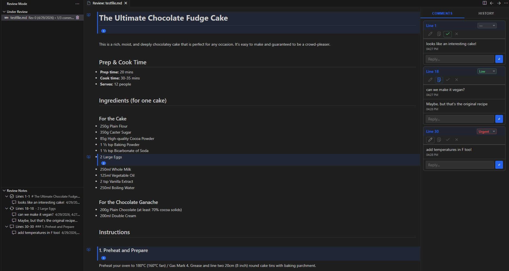

# Review Mode for VS Code



Review Mode is a powerful VS Code extension designed to bring enhanced collaboration and review tools directly into your editor for any text file.

It can be used in two primary ways:
1. **Standalone Review Tool**: Review and annotate code, documentation, or any text file locally without needing an external platform.
2. **AI-Assisted Plan Review**: Turn your editor into a collaborative planning surface where you and your AI agent iterate on design and implementation plans, powered by the Review Mode MCP server.

## Features

- **Inline Threaded Annotations**: Add, reply to, and resolve comments directly within your text files. Keep all your feedback contextualized.
- **Revision Tracking**: Automatically track revisions of your documents and see how comments evolve over time.
- **Visual Status Tracking**: Quickly identify the status of comments using intuitive icons.
- **Review History UI**: A dedicated Review Notes panel in the Explorer allows you to easily navigate through all annotations.
- **Customizable Priorities**: Assign priorities to comments (e.g., Low, Medium, High) so you know what needs addressing first.

## AI-Assisted Plan Review Workflow

```text
AI writes plan → Opens in Review Mode → You annotate → AI reads feedback → Updates plan → Repeat
```

1. **The AI writes a plan.** Instead of printing it in chat, the AI saves it as a Markdown file and opens it in Review Mode.
2. **You review and annotate.** In the Review Mode panel, you can:
   - Click the **+** button next to any line to add a comment
   - Set comment **priority** (none, low, medium, high, urgent)
   - Set comment **status** (open, in-progress, resolved, won't fix)
   - Reply to existing comment threads
3. **You ask the AI to iterate.** Tell the AI something like:
   - _"Refine the plan with my comments"_ — the AI will update the plan and reopen Review Mode for another round
   - _"Implement my comments and proceed"_ — the AI will finalize the plan and ask for confirmation before starting implementation
4. **The AI processes your annotations:**
   - Comments it can fully address → implemented and marked **resolved**
   - Comments needing clarification → the AI replies in the thread (prefixed with `[AGENT]`) and marks **in-progress**
   - Comments it disagrees with → the AI explains why and marks **won't fix**
5. **Repeat until satisfied.** When all comments are resolved and you're happy with the plan, tell the AI to proceed with implementation.

## Setting Up with Your AI Tool

### One-Click Install

The extension includes a unified **Install Skills** command that sets up everything you need — the MCP server, agent workflows, and editor-specific configuration — in a single step.

1. Open the Command Palette (`Ctrl+Shift+P`) and run **Review Mode: Install Skills**, or click the ⬇ icon in the Review Mode sidebar panel.
2. Pick your editor: **Cline**, **Cursor**, or **VS Code (Copilot)**.
3. The extension will:
   - Install (or upgrade) the `review-mode-mcp` server via [`uv tool`](https://docs.astral.sh/uv/)
   - Copy the appropriate agent workflows and skills into the correct locations
   - Register the MCP server in your editor's configuration

> **Prerequisite:** [`uv`](https://docs.astral.sh/uv/getting-started/installation/) must be installed and available on your PATH.

When you update the extension, you'll be prompted to re-run Install Skills so your agent files stay in sync.

### What Gets Installed

| Editor | MCP server | Workflows & skills | MCP config |
|--------|-----------|-------------------|------------|
| **Cursor** | `uv tool install review-mode-mcp` | Copied to `~/.cursor/plugins/local/review-mode/` (rules + skills + `mcp.json`) | Bundled in the plugin directory |
| **Cline** | `uv tool install review-mode-mcp` | Copied into the workspace (`.clinerules/workflows/`, `.cline/skills/`) | Auto-added to Cline's `cline_mcp_settings.json` |
| **VS Code (Copilot)** | `uv tool install review-mode-mcp` | Provided by the extension's built-in MCP definition provider | Registered automatically via VS Code's MCP API |

### Agent Workflows

After installation, your AI agent gains two slash-command workflows:

| Command | What it does |
|---------|-------------|
| `/review-mode` | Opens the current plan (or a specified file) in Review Mode so you can annotate it with inline comments. |
| `/update-plan` | Reads your annotations, implements the requested changes, resolves comments, and re-opens the file for another review round. |

These workflows are installed as Cursor rules (`.mdc` files) or Cline workflow rules (`.md` files), and they teach the agent the full review loop automatically.

### Manual MCP Configuration

If you prefer to configure the MCP server manually instead of using Install Skills, install it with `uv` and add the JSON block to your MCP settings:

```bash
uv tool install review-mode-mcp
```

```json
{
  "mcpServers": {
    "review-mode-mcp": {
      "command": "review-mode-mcp"
    }
  }
}
```

## Review Mode Controls

### Adding Comments

1. Open any text file.
2. Open a file in Review Mode (click the 💬 icon in the editor title bar, or use the command palette: **Review Mode: Open File**)
3. In the Review Mode panel, click the **+** button next to the line you want to comment on
4. Type your comment and press Enter

### Managing Comments

- **Priority:** Click the priority dropdown on any comment to set urgency
- **Status:** Click the status badge to change it:
  - `open` — New comment, not yet addressed
  - `in-progress` — Being worked on or awaiting clarification
  - `resolved` — Fully addressed
  - `won't fix` — Acknowledged but not implementing
- **Reply:** Click the reply button to add a message to the thread
- **Delete:** Click the trash icon to remove a comment or message

### Sidebar

The Review Mode activity bar icon (left sidebar) shows:
- **Under Review** — All files currently being reviewed
- **Review Notes** — Annotations for the active review (when a file is open in Review Mode)

## Extension Details

- **Icon / Codicon Support**: Uses built-in VS Code codicons for visually consistent feedback and interaction.
- **Data Storage**: Annotations and threads are stored efficiently in local JSON metadata files alongside your documents.

### Configuration

| Setting | Default | Description |
|---------|---------|-------------|
| `reviewMode.revisionsDirectory` | `.revisions` | Directory name for storing revision snapshots and annotation data |

Change this in VS Code settings (`Ctrl+,`) → search for "Review Mode".

### File Structure

When you review a file, Review Mode creates a revision directory:

```text
.revisions/
└── my_plan_md/              # Flattened path of the reviewed file
    ├── revisions.json        # Index of all revisions
    ├── myplan.rev0.md        # Snapshot of the file at revision 0
    ├── rev0.json             # Annotations for revision 0
    ├── myplan.rev1.md        # Snapshot at revision 1
    └── rev1.json             # Annotations for revision 1
```

- **Snapshots** are read-only copies of the file at each revision point
- **Annotations** are JSON files containing all comments, priorities, and statuses
- **The original file is never modified** by Review Mode — only the AI agent edits it when iterating

## Tips

- **Be specific in your comments.** Instead of "this needs work", say "add error handling for the case where the API returns 404".
- **Use priorities** to signal what matters most. The AI will see them.
- **Use threads for discussion.** If the AI asks a clarifying question (prefixed with `[AGENT]`), reply in the same thread to keep context together.
- **Don't rush to implement.** Take as many review rounds as you need — the goal is a solid plan before any code is written.